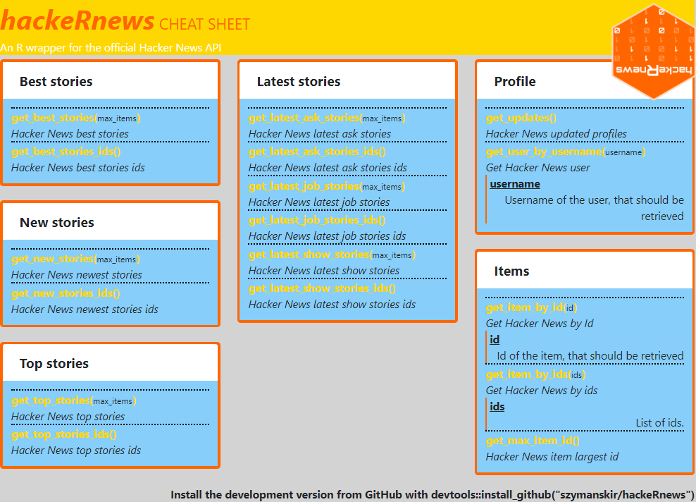
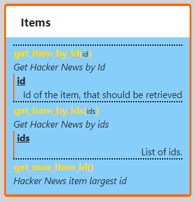

# cheatsheetGenerator

The app is available on heroku: https://cheatsheet-generator-web-test.herokuapp.com/

Run the app in a docker container with:
```
docker-compose up
```

Configuration examples, that can be uploaded to generator, can be found [here](https://github.com/magierska/cheatsheetGenerator/tree/master/example).

## Content configuration

Content of cheatsheet can be configured by loading .json file and/or editing Configuration (.json) input field.

File structure is presented below:

```
{
	"name": "Library name",
	"description": "Library description",
	"footer": "Content of footer",
	"pages": [{
    "cards": [{
      "title": "Card title",
      "methods": [{
        "name": "method",
        "description": "Method description",
        "params": [{
          "name": "param",
          "description": "Parameter description"
        }]
      },{
        "name": "method_without_brackets",
        "description": "Method without parameters in brackets",
        "withoutBrackets": true,
        "params": [{
          "name": "param",
          "description": "Parameter description"
        }],
        "examples": [
          "method_without_brackets(1)"
        ]
      }]
    }]
  }]
}

```

Elements of pages array are cards located on specific page. Cards are displayed in columns in order set in configuration file. For each card title and methods can be defined. Methods is an array containing names, descriptions and parameters. Method parameters are printed between "()" next to method name. In addition, if parameter description is defined, parameter description will appear under method description.

## Styles configuration

You can configure cheatsheet styles with css. Upload your .css file and/or edit Configuration (.css) input field.

### General
The exemplary cheatsheet with possible changes is presented below:



To edit styles for whole cheatsheet do not specify class:
```
background-color: lightGray;
```

Header:
```
.header {
  background-color: gold;
}

.header-title {
  color: rgba(255, 102, 0);
}

.header-title-name {
  font-style: italic;
}

.header-description {
  color: white;
}
```

Logo:
```
.logo {
  transform: rotate(180deg);
}
```

Footer:
```
.footer {
  font-weight: bold;
}
```

### Card



For changes affecting cards use these classes:

```
.card {
  border: 3px solid rgba(255, 102, 0);
}

.card-header {
  border: none;
  background-color: white;
}

.card-body {
  background-color: lightskyblue;
}
```

Methods are located inside cards. Use these classes to change theirs style:
```
.method {
  border-top: 2px dotted black;
}

.method-name {
  color: gold;
}

.method-parameter {
  font-size: x-small;
}

.method-description {
  font-style: italic;
}
```

Also parameters (for each method) can be changed:
```
.parameter {
  border-left: 2px solid rgba(255, 102, 0);
}

.parameter-name {
  text-decoration: underline;
}

.parameter-description {
  text-align: right;
}
```

To change styles of examples this class should be used:
```
.example {
  font-size: x-small;
}
```
